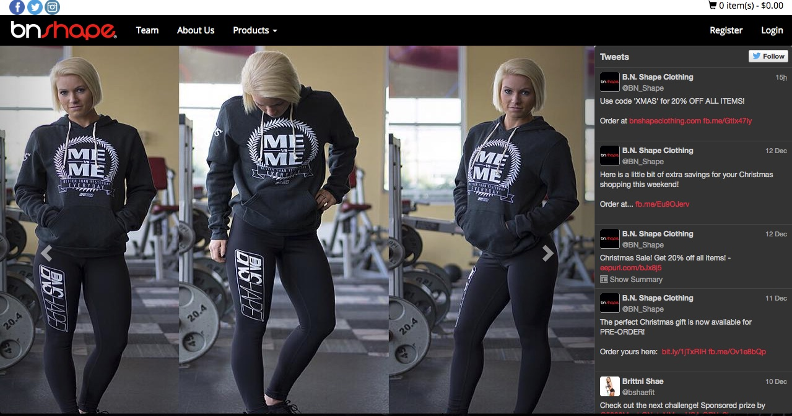
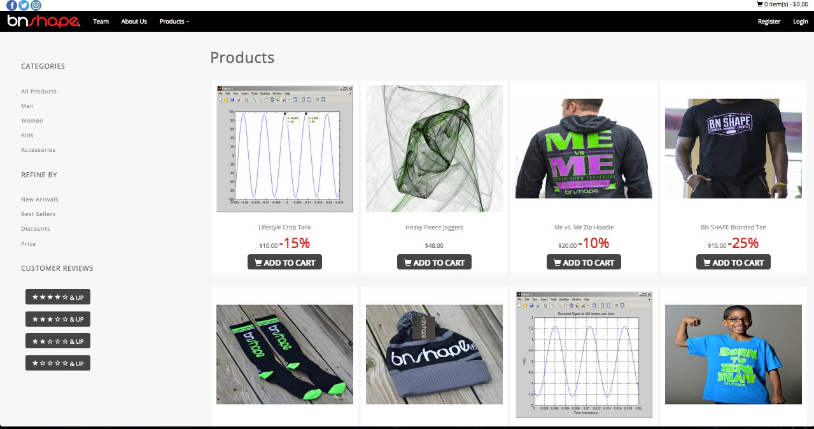
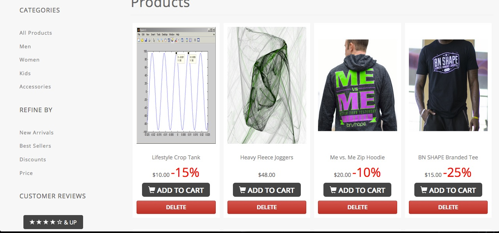
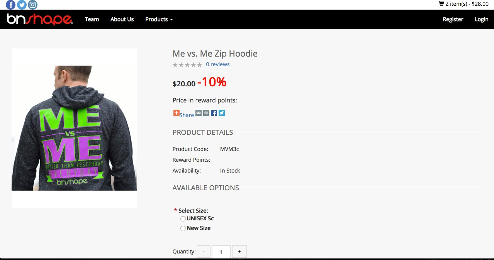
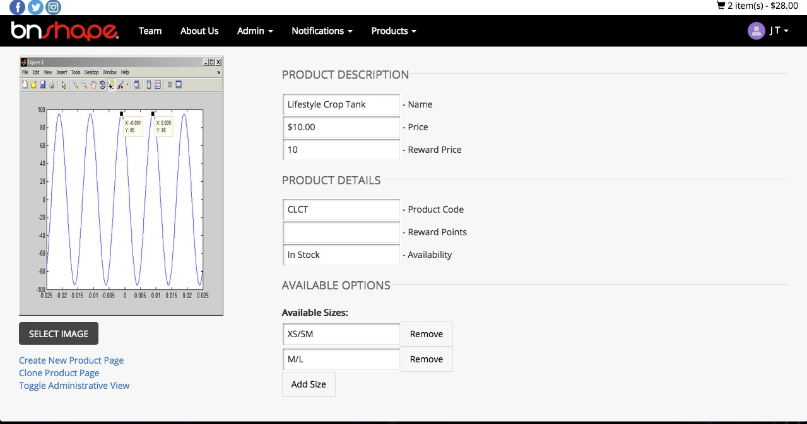
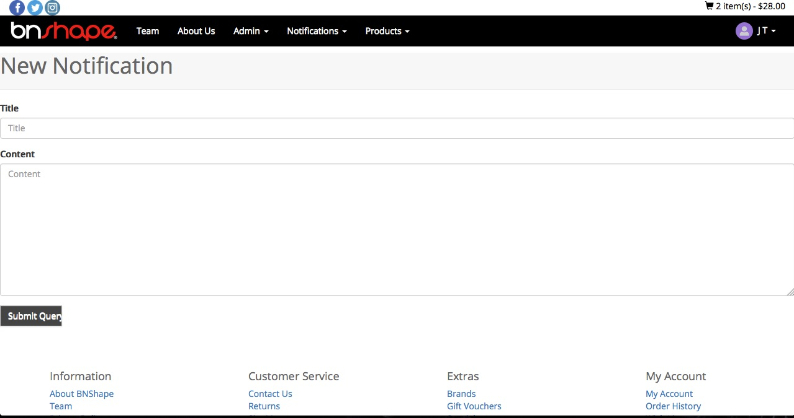
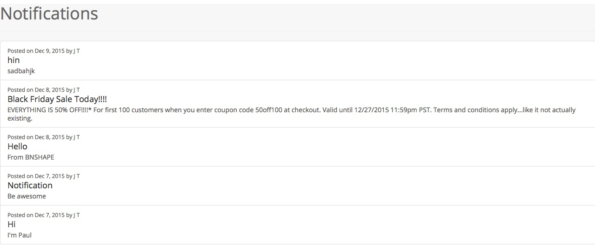
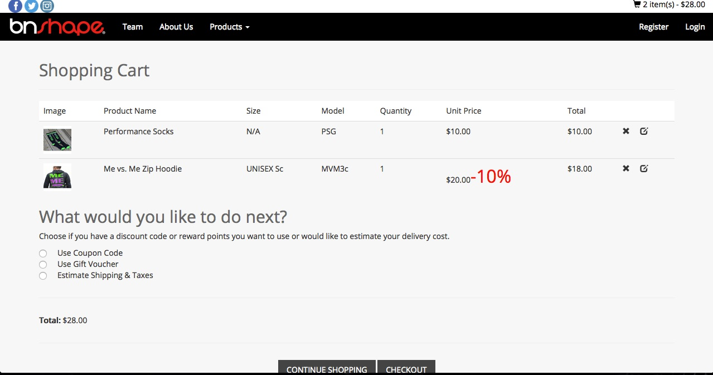
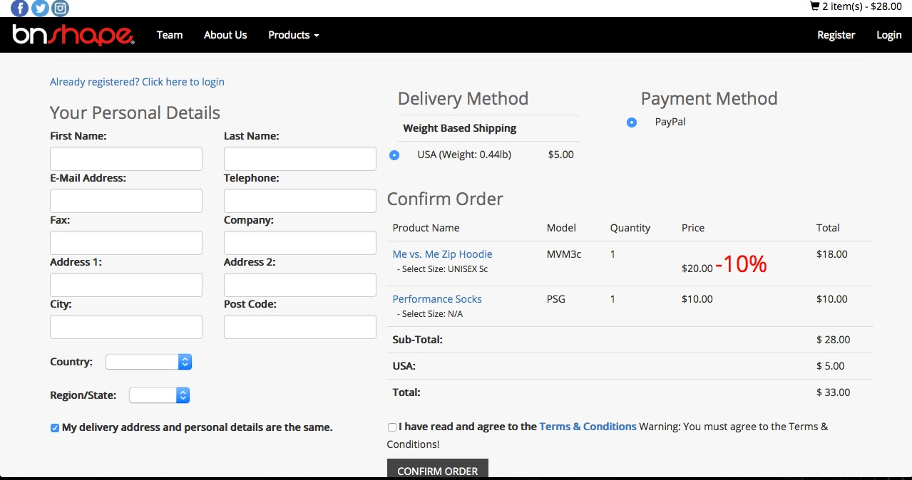

[](http://bnshapeclothing.com/)

B.N. Shape Clothing was founded by Dr. Dozie Onunkwo, but it is more than just a clothing brand. It focuses on encouraging individuals to maintain a healthy lifestyle through fitness and appropriate eating habits.

## Deployed Site
Browse our current site at [https://mysterious-brook-4241.herokuapp.com/](https://mysterious-brook-4241.herokuapp.com/).

## Implented Features
* Product browsing
* Product creation and editing
* BNShape Twitter feed
* Notification system
* Cart
* Product viewing
* Order page

## Screenshots
* Landing page
	
* Products page (user & admin)
	* user
	
	* admin
	
* Product view (user & admin)
	* user
	
	* admin
	
* Notifications (creation & list)
	* creation
	
	* list
	
* Cart
	
* Order page
	
* To view more checkout /screenshots directory!

## How To Get Started
Make sure you have installed all of the following prerequisites on your development machine:
* Node.js - [Download & Install Node.js](http://www.nodejs.org/download/) and the npm package manager. If you encounter any problems, you can also use this [GitHub Gist](https://gist.github.com/isaacs/579814) to install Node.js.
* MongoDB - [Download & Install MongoDB](http://www.mongodb.org/downloads), and make sure it's running on the default port (27017).
* Bower - You're going to use the [Bower Package Manager](http://bower.io/) to manage your front-end packages. Make sure you've installed Node.js and npm first, then install bower globally using npm:

```bash
$ npm install -g bower
```

* Grunt - You're going to use the [Grunt Task Runner](http://gruntjs.com/) to automate your development process. Make sure you've installed Node.js and npm first, then install grunt globally using npm:

```bash
$ npm install -g grunt-cli
```

## Downloading Our Repository
This should be used by future CEN3031 groups working with Dr. Dozie

### Cloning The GitHub Repository
The recommended way to download our repository is to use git to directly clone:

```bash
$ git clone https://github.com/CEN3031Group5B/BNShape.git BNShape
```

This will clone the latest version of the repository to a **BNShape** folder.

The first thing you should do is install the Node.js dependencies. Our application was built off of the MEAN.js boilerplate.

The boilerplate comes pre-bundled with a package.json file that contains the list of modules you need to start your application.

To install Node.js dependencies you're going to use npm again. In the application folder run this in the command-line:

```bash
$ npm install
```

This command does a few things:
* First it will install the dependencies needed for the application to run.
* If you're running in a development environment, it will then also install development dependencies needed for testing and running your application.
* Finally, when the install process is over, npm will initiate a bower install command to install all the front-end modules needed for the application

## How To Run
After the install process is over, you'll be able to run your application using Grunt, just run grunt default task:

```
$ grunt
```

The application should run on port 3000 with the *development* environment configuration, so in your browser just go to [http://localhost:3000](http://localhost:3000)

That's it! The application should be running.

## How To Troubleshoot
Since our application was created using the MEAN.js boilerplate we recommend you visit the [MEAN](https://github.com/meanjs/mean) repository directly for more information. Also, we recommend you go over the [Official MEAN.js Documentation](http://meanjs.org/docs.html) for additional advice.

## Credits
* MEAN.js (https://github.com/meanjs/mean)
* Bootstrap (http://getbootstrap.com/)
* Twitter Widget (https://support.twitter.com/articles/20170071?lang=en)
* Angularjs (https://angularjs.org/)
* BNShape clothing (http://bnshapeclothing.com/)
